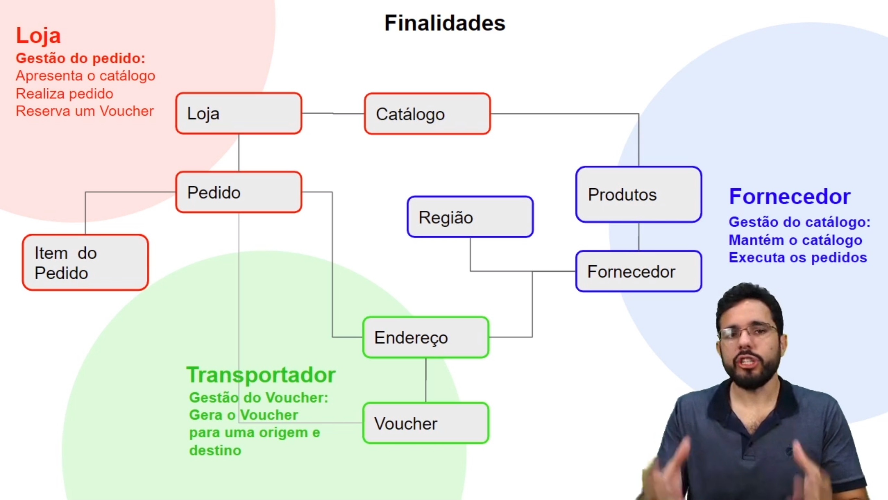
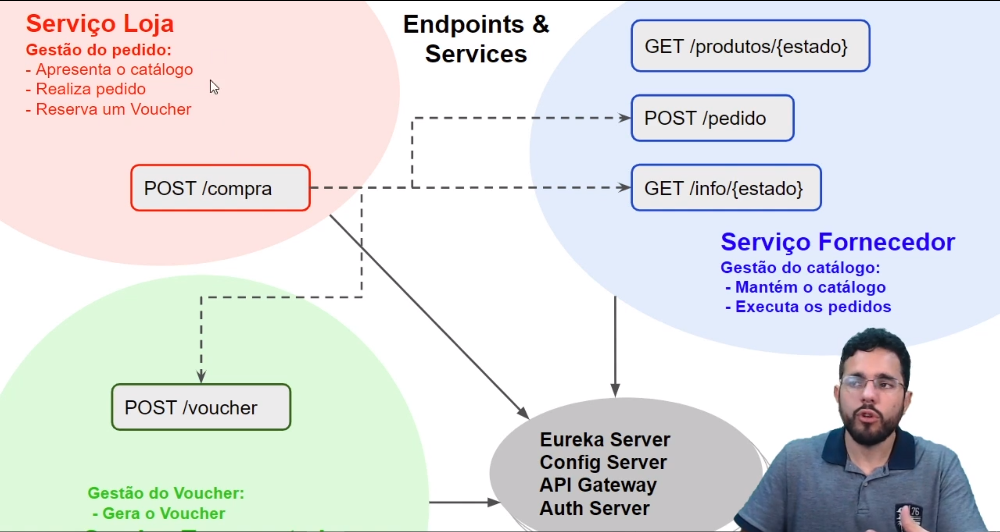

# Flower Store

This project is based on an Alura course on Microservices with Spring Cloud.

The commits tell the story of the application development. You may want to start there if you're using this project to study microservices.

## Requirements to develop

- You must configure the config-server `application.yml` file with at least the `search-locations` property. You may change to the location of your own config repo on your local machine or use the commented configuration to use a github repository.
- A MariaDB instance running with the following schemas already created:
  - supplier
  - storefront
  - Note: you can configure the database, connection info and schema name on the configuration files on the config-server.

## Test Stuff

- There's a [cartRequests.jmx](README/cartRequests.jmx) to be imported on JMeter and test Hystrix.
- There's a [insomnia_requests.json](README/insomnia_requests.json) file to be imported on [Insomnia](https://insomnia.rest/download/) and test all endpoints.

## Components

### Store Front 

`storefront` folder. 

- The Store itself, like a website where a user buys flowers and stuff.
- Balances the requests to suppliers and carriers locally (client-side load-balancing) by fetching and caching Eureka server information (ribbon).
- Uses Hystrix to control timeout on methods that use other microservices.
- Uses Bulkhead (from Hystrix) to separate a group of threads for each operation managed by Hystrix.
- Controls the integration with other microservices.
  - RECEIVED: order created on the `storefront` microservice.
  - SUPPLIER_ORDER_CREATED: order incremented with information from the `supplier` microservice.
  - CARRIER_VOUCHER_CREATED: order incremented with information from the `carrier` microservice.
- Integrates with the authentication server.
- Forwards authentication headers to other microservices with a RequestInterceptor bean.

### Supplier 

`supplier` folder.

- Someone who provides products on different locations.
- Provides Orders to the `storefront` component.
- Integrates with the authentication server.

### Carrier 

`carrier` folder.

- Someone who delivers stuff to clients from the suppliers.
- Provides Vouchers to the `storefront` component.
- Integrates with the authentication server.

### Authentication Server

`auth-service` folder.

- This is an OAuth server tying together Spring Security and Spring Cloud OAuth2.
- Spring Security configures a user (hardcoded =).
- Spring Cloud OAuth2 configures a client of the authorization server, the `storefront` (hardcoded =).

### API Gateway

`zuul-api-gateway` folder.

- Clients make requests for the API Gateway, which then redirects to the correct microservice for the request.
- Implemented with Netflix Zuul.
- Integrates (automatically) with Eureka to get microservices instances.
- Does client-side load balancing with Ribbon automatically.

### Eureka server 

`eureka-server` folder.

- Handles service registry and discovery.
- Every component registers itself here.
- Balancing is on the client, ~~via a RestTemplate bean configured to use Eureka server as a client~~ (this was replaced by the FeignClient. See older commits to understand how to configure a RestTemplate to work with Eureka Client).
- Balancing is on the client through FeignClient, which is auto-configured on each application to balance requests when eureka client is being used.

### Config Server 

`config-server` folder.

- Provides configuration to the microservices.  The `config-repo` folder is used to store the configuration files.

### Other Stuff

- I've configured to log to papertrail (a log aggregator as a service) and used Spring Cloud Sleuth to add a traceId to every user request, being able to trace  the request across microservices.
- The logback.xml on each "domain" microservice does the magic. This will stop working after a while...

## Running

- Run each of them separately using `./mvnw spring-boot:run` on each folder.

## Domain

TODO: improve/translate.

## Endpoints and Services

TODO: list them.

